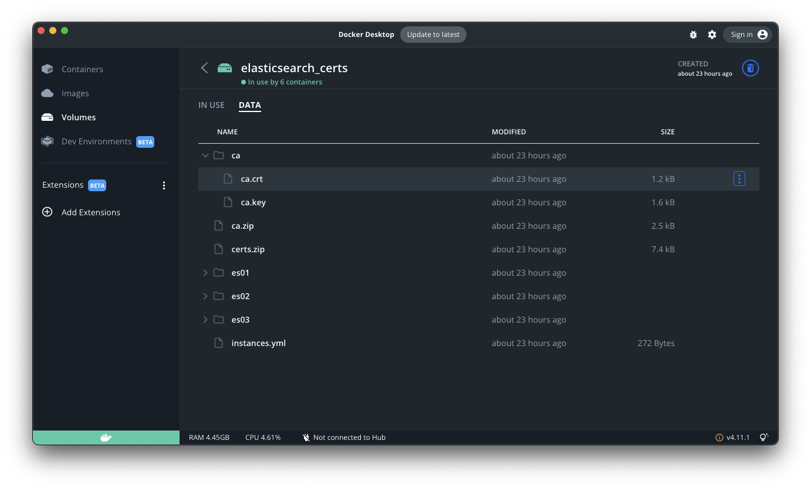

# Please visit our AWS server at 18.118.170.215:4200.  

# If our AWS server at 18.118.170.215 is down, please text Frank Salamone at 585-313-0029 (Not in the middle of the night please :- ) )

# Medical Record Search Engine by DivideByZero

## Prerequisites
1. Docker and Docker Desktop https://www.docker.com

## Elasticsearch
### Setup
```bash
# from main directory
# spin up containers
docker-compose up -d
# check whether all containers are running
docker-compose ps
```
Once all containers are up running, replace `./elasticsearch/ca.crt` with the certificate of Elasticsearch service from docker volume to `./elasticsearch`. This can be done through .

### Indexing patient charts
```bash
# go to the root dir of this project first
# activate virtual env
python3 -m venv .venv
source .venv/bin/activate
# install dependencies
pip install -r requirements.txt
# indexing
cd elasticsearch
python indexing.py
```

### Check all documents in Elasticsearch
- Go to http://localhost:5601  
- Login with `username:elastic password:elasticsearch`
- Navigate to http://localhost:5601/app/enterprise_search/content/search_indices

## Fastapi backender server
### Setup
Once elasticsearch is setup, this is ready to go  
Backend server is using Fastapi framework. Refer to this for details. https://fastapi.tiangolo.com/tutorial/

### Spin up the server
```bash
cd backend
uvicorn server:app --reload
```
All API can be found in the by-product swagger site. http://localhost:8000/docs

### Setup the frontend
Install the lts verstion of node.js https://nodejs.org/en/download/
You can install npm after you have node installed by running the following inside of the /frontend folder in the project:
```bash
npm install
```

The following commands should can be run to verify you installed node and npm successfully
```bash
node -v
npm -v
```

Install the Angular CLI so you can run the frontend locally
```bash
npm install -g @angular/cli
```

Cd to the frontend directory inside the project and use the following to start the frontend
```bash
ng serve
```
When you are done use ctrl+C to kill it.

The frontend should now appear on any browser at http://localhost:4200/

Development IDEs like visual code should be able to connect to it for debugging and development. (saving reloads the page, and errors show up in the IDE)

If you want to run the backend and frontend locally you need to change the hard coded URL in the frontend file frontend\src\app\patient-search\patient-search.component.ts to point to your backend.
